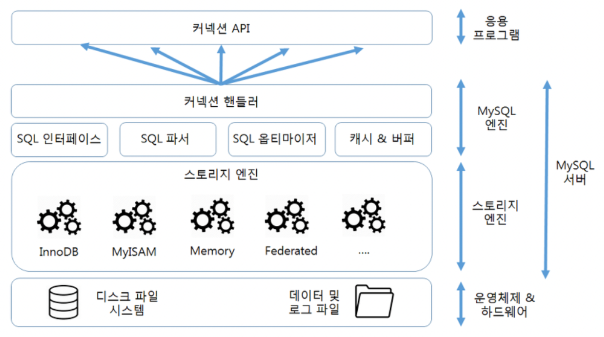
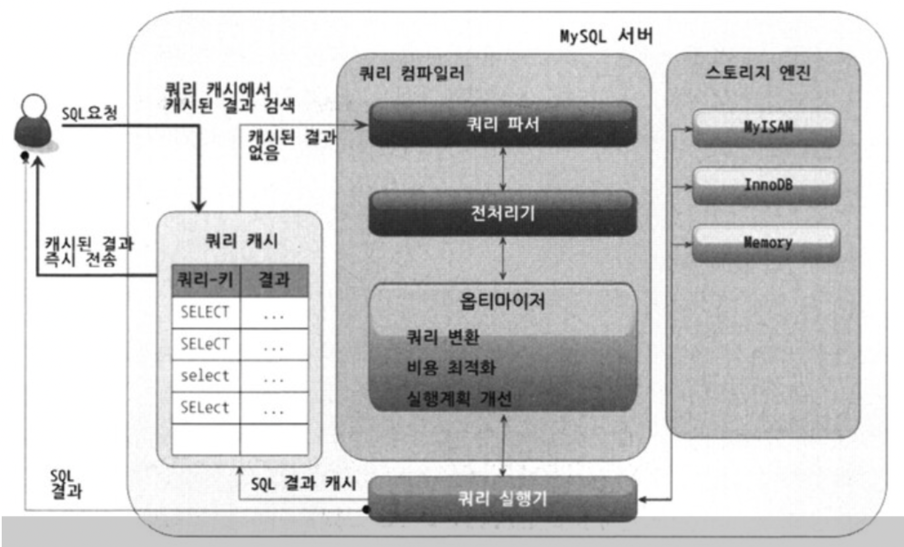
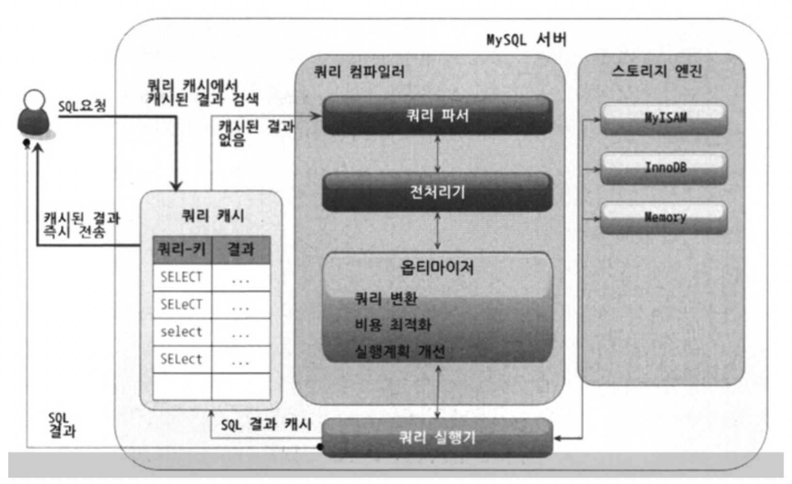

# 04. 아키텍처 (1)

날짜: 2022/07/13  
분류: 정리  
설명: Real MySQL 1번째 스터디 수요일 리딩  
페이지: 77 ~ 107  
[Notion Link](https://namkyung2.notion.site/04-1-b4196699f67a4d3d8c6e66c808f82bf7)


다른 DBMS에 비해 구조가 독특하다
독특한 구조로 엄청난 **혜택**을 누릴수도 다른 DBMS에서 **문제**되지 않을 것들이 문제가 되기도 한다

### # MySQL = MySQL 엔진 + MySQL 스토리지 엔진

**MySQL 엔진**

- 커넥션 핸들러와 SQL 파서 및 전처리기 , 옵티마이저가 중심
- MySQL은 표준 **ANSI SQL 문법**을 지원하기 때문에 타 DBMS와 호환되어 실행 가능

**스토리지 엔진**

- DBMS의 **두뇌** → 요청된 SQL 문장 분석 / 최적화
- 실제 데이터를 디스크 스토리지에 저장하거나 읽어오는 부분 전담
- MySQL 엔진은 하나지만 스토리지 엔진은 여러 개를 동시에 사용할 수 있다
  - CREATE TABLE test_table (fd1 INT, fd2 INT) ENGINE=INNODB;
    - test_table은 InnoDB 스토리지 엔진을 사용하도록 정의
    - CRUD 작업이 발생하면 InnoDB 스토리지 엔진이 처리 담당
    - 성능 향상을 위한 **키 캐시** (MyISAM 스토리지 엔진) , **InnoDB 버퍼 풀** 기능 내장

**핸들러 API**

- **핸들러 요청 = 스토리지 엔진에 쓰기 / 읽기 요청**
- 핸들러 요청에 사용되는 API
- SHOW GLOBAL STATUS LIKE ‘Handler%’;

### # MySQL 스레딩 구조


- 프로세스 기반이 아닌 **스레드** 기반 작동
- **포그라운드 스레드** , **백그라운드 스레드**
  - SELECT thread_id, name, type processlist_user, processlist_host FROM
    performance_schema, threads ORDER BY type, thread_id; - 동일한 이름의 스레드가 2개 이상씩 보이는 것은 **병렬**로 처리하는 경우이다

**포그라운드 스레드 ( 클라이언트 스레드 )**

- **포그라운드 스레드 수 = MySQL 서버에 접속된 클라이언트의 수**
- **클라이언트 사용자가 요청하는 쿼리 문장을 처리한다**

  - 사용자 요청 작업을 마치고 커넥션을 종료하면 해당 커넥션을 담당하던 스레드는
    **스레드 캐시**(Thread Cache)로 되돌아간다 - 스레드 캐시에 일정 개수 이상의 대기 중인 스레드가 있으면 스레드 캐시에 넣지 않고
    스레드를 종료시켜 **일정 개수의 스레드만 스레드 캐시에 존재하게 한다** - 최대 스레드 개수는 thread_cache_size 시스템 변수로 설정한다

- **데이터는 데이터 버퍼나 캐시로부터 가져오며, 없는 경우 디스크의 데이터나 인덱스 파일로부터 찾는다**
- MyISAM 테이블은 디스크 쓰기 작업까지 포그라운드 스레드
- **InnoDB 테이블은 데이터 버퍼나 캐시까지만 포그라운드 스레드 처리
  버퍼로부터 디스크까지 기록하는 작업은 백그라운드 스레드**

**백그라운드 스레드**

- Insert Buffer를 병합하는 스레드
- 로그를 디스크로 기록하는 스레드
- InnoDB 버퍼 풀의 데이터를 디스크에 기록하는 스레드
- 데이터를 버퍼로 읽어 오는 스레드
- 잠금이나 데드락을 모니터링하는 스레드

**로그 스레드**와 버퍼의 데이터를 디스크로 내려쓰는 작업을 하는 **쓰기 쓰레드**가 **가장 중요**

- 읽기 스레드는 많이 설정할 필요가 없다
  - InnoDB에서도 데이터를 **읽는 작업**은 주로 **클라이언트 스레드에서 처리**되기 때문
- **쓰기 스레드**는 많은 작업을 백그라운드로 처리하기 때문에 일반적인 **내장 디스크** 사용할 경우 **2~4** 정도
  **DAS , SAN**과 같은 스토리지 사용할 때는 디스크를 최적으로 사용할 수 있을 만큼 **충분히 설정**

> **데이터의 쓰기 작업은 지연(버퍼링)되어 처리될 수 있지만 읽기 작업은 절대 지연될 수 없다**

일반적인 DBMS에는 쓰기 작업을 버퍼링해서 일괄 처리하는 기능이 탑재

> - **InnoDB**에서는 CUD 쿼리로 디스크로 데이터가 완전히 저장될 때까지 **기다리지 않아도 된다**
> - MyISAM은 사용자 스레드가 쓰기 작업까지 함께 처리하도록 설계돼 있다
>   - 일반적인 쿼리는 쓰기 버퍼링 기능을 사용할 수 없다

### # 메모리 할당 및 사용 구조


- **글로벌 메모리 영역 + 로컬 메모리 영역**
  - 스레드가 **공유해서 사용하는 공간인지 여부에 따라** 구분한다
- MySQL 시스템 변수로 설정해 둔 만큼 OS로부터 메모리를 할당받는다

**글로벌 메모리 영역**

- 클라이언트 스레드의 수와 무관하게 **하나**의 메모리 공간만 할당되며 **모든 스레드에 의해 공유**된다
- 테이블 캐시 , InnoDB 버퍼 풀 , InnoDB 어댑티브 해시 인덱스 , InnoDB 리두 로그 버퍼

**로컬 메모리 영역 ( 세션 메모리 영역 )**

- 정렬 버퍼 , 조인 버퍼 , 바이너리 로그 캐시 , 네트워크 버퍼
- **클라이언트 스레드가 쿼리를 처리하는 데 사용하는 메모리 영역**
  - 커넥션 버퍼 , 정렬 버퍼 등
  - 클라이언트 스레드별로 독립적으로 할당되며 절대 공유되어 사용되지 않는다
  - 커넥션 열려 있는 동안 계속 할당된 상태로 남아 있는 공간 : 커넥션 버퍼 , 결과 버퍼
  - 쿼리를 실행하는 순간에만 할당했다가 해제 하는 공간 : 정렬 버퍼 , 조인 버퍼

### # 쿼리 실행 구조



**쿼리 파서**

- 사용자 요청으로 들어온 쿼리 문장을 토큰으로 분리해 **트리 형태 구조**로 만드는 작업
- **문법 오류** 발견

**전처리기**

- 파서 트리 기반으로 쿼리 문장에 **구조적인 문제점** 확인
  - 테이블 이름, 컬럼명, 내장 함수, 객체 존재 여부, 접근 권한 등 확인

**옵티마이저**

- 쿼리문을 저렴한 비용으로 가장 빠르게 처리할 지를 결정하는 역할 , **DBMS의 두뇌**

**실행 엔진**

- 옵티마이저 = 두뇌 , 실행 엔진과 핸들러는 **손과 발**
  - 옵티마이저=경영진 , 실행 엔진=중간 관리자 , 핸들러=실무자

> **예시) 옵티마이저가 GROUP BY를 처리하기 위해 임시 테이블을 사용하기로 결정했다**
>
> 1. 실행 엔진이 핸들러에게 임시 테이블을 만들라고 요청
>
> 2. 실행 엔진은 WHERE 절에 일치하는 레코드를 읽어오라고 핸들러에게 요청
>
> 3. 읽어온 레코드들을 1번에서 준비한 임시 테이블로 저장하라고 다시 핸들러에게 요청
>
> 4. 데이터가 준비된 임시 테이블에서 필요한 방식으로 데이터를 읽어 오라고 핸들러에게 다시 요청
>
> 5. 최종적으로 실행 인진은 결과를 사용자나 다른 모듈로 넘김
>
> → **실행 엔진은 만들어진 계획대로 핸들러에게 요청해서 받은 결과를 또 다른 핸들러 요청의 입력으로 연결**

**핸들러 ( 스토리지 엔진 )**

- **데이터를 디스크로 저장하고 디스크로부터 읽어오는 역할**
  - **핸들러 = 스토리지 엔진**
  - MyISAM 테이블을 조작하는 경우에는 핸들러가 MyISAM 스토리지 엔진
  - InnoDB 테이블을 조작하는 경우에는 핸들러가 InnoDB 스토리지 엔진

### # 복제

- **Replication**은 매우 중요한 역할 , 16장에서 다시 만나요 ~

### # 쿼리 캐시

- 빠른 응답을 필요로 하는 웹 기반의 응용 프로그램에서 매우 중요한 역할을 담당
- SQL의 실행 결과를 메모리에 캐시
  - 동일한 SQL 쿼리가 실행되면 테이블을 읽지 않고 즉시 결과를 반환
  - 테이블의 데이터가 변경되면 캐시 저장된 결과 중 관련된 것들은 모두 삭제해야한다
    - 심각한 동시 처리 성능 저하 유발
    - MySQL 8.0으로 올라오면서 쿼리 캐시는 완전히 **제거**, 시스템 변수도 제거
      - 실제 큰 도움은 안되고 수많은 버그의 원인 , 잘 버렸다.

### # 스레드 풀

- 서버 엔터프라이즈 에디션은 스레드 풀 지원 O
- 커뮤니티 에디션은 스레드 풀 기능 지원 X
- **Percona Server**에서 제공하는 스레드 풀 기능도 있다
  - 내장이 아닌 **플로그인 형태**로 동작
- 일반적으로 CPU코어의 개수와 스레드 그룹의 개수를 맞춰 CPU 프로세서 친화도를 높인다

  - **스레드 풀의 목적**

    실행 중인 스레드들을 CPU가 최대한 잘 처리해낼 수 있는 수준으로 줄여 빨리 처리하게 하는 기능

    스레드풀은 목적은 내부적으로 사용자의 요청을 처리하는 스레드 개수를 줄여서 동시 처리되는 요청이
    많다 하더라도 MySQL 서버의 CPU가 제한된 개수의 스레드 처리에만 집중할 수 있게 해서 서버의 자원
    소모를 줄이는 것이 목적

    **제한된 수의 스레드로 CPU의 프로세서 친화도를 높이고 OS를 위해 불필요한 컨텍스트 스위칭을 줄이자**

  - **스레드 그룹의 모든 스레드가 일을 처리하고 있다면 ?**
    새로운 작업 스레드를 추가할 지 기존 작업 스레드가 처리를 완료할 때까지 기다릴 지 여부를 판단
    타이머 스레드가 주기적으로 스레드 그룹 상태를 체크하고 지정된 시간(밀리초)만큼 작업 스레드가 현재 처리 중인 작업을 끝내지 못하면 새로운 스레드를 생성해서 스레드 그룹에 추가한다
    전체 스레드 풀에 있는 스레드 개수는 thread_pool_max_threads 시스템 변수 설정값을 넘을 수 없다

### **# InnoDB 스토리지 엔진 아키텍처**



- MySQL 스토리지 엔진 중 거의 유일하게 **레코드 기반의 잠금을 제공**한다
  - 이로 인해 높은 **동시성 처리가** 가능하고 **안정적이며 성능**이 뛰어나다

**PK에 의한 클러스터링**

- **PK의 값 순서대로 디스크에 저장된다**
- 모든 Secondary Index는 레코드의 주소 대신 **PK의 값을 논리적인 주소**로 사용한다
- PK가 **클러스터링 인덱스**이기 때문에 PK를 이용한 **Range scan**은 상당히 빠르다
- 쿼리의 실행 계획에서 PK는 기본적으로 다른 보조 인덱스에 비해 비중이 높게 설정
  - 다른 보조 인덱스보다 PK가 선택될 확률이 높다
- MyISAM 스토리지 엔진에서는 클러스터링 키를 지원하지 않는다

**외래 키 지원**

- InnoDB 스토리지 엔진 레벨에서 지원하는 기능
  - MyISAM , MEMORY 테이블에서는 사용 불가
- InnoDB에서 외래 키는 부모 테이블과 자식 테이블 모두 해당 칼럼에 인덱스 생성이 필요하고
  변경 시에는 반드시 부모 테이블이나 자식 테이블에 데이터가 있는 지 체크하는 작업이 필요하므로
  잠금이 여러 테이블로 전파되고 그로 인해 데드락이 발생할 때가 많으므로 개발할 때도 외래 키의 존재에 주의

**MVCC ( Multi Version Concurrency Control )**

- **레코드 레벨의 트랜잭션을 지원하는 DBMS가 제공하는 기능**
- 잠금을 사용하지 않는 일관된 읽기를 제공하는 목적

- **Isolation level이 READ_COMMITTED인 InnoDB 스토리지 엔진을 사용하는
  테이블의 데이터 변경 시 처리 과정**

  ````sql
  CREATE TABLE member(
  m_id INT NOT NULL,
  m_name VARCHAR(20) NOT NULL,
  m_area VARCHAR(100) NOT NULL,
  PRIMARY KEY (m_id),
  INDEX ix_area (m_area)
  );

      INSERT INTO member(m_id, m_name, m_area) VALUES (12,’홍길동',’서울');
      COMMIT;

      UPDATE member SET m_area=’경기' WHERE m_id=12;

      update문이 실행되면 커밋 실행 여부와 관계없이 InnoDB 버퍼 풀은 새로운 값인 ‘경기'로 업데이트

      디스크 파일에는 체크포인트나 InnoDB의 쓰기 스레드에 의해 새로운 값으로 업데이트 될 수도 아닐 수도 있다
      InnoDB가 ACID를 보장하기 때문에 버퍼 풀과 데이터 파일은 동일한 상태라고 봐도 무방하다

      COMMIT이나 ROLLBACK이 되지 않은 상태에서 다른 사용자가 해당 레코드를 조회한다면 ?
      SELECT * FROM member WHERE m_id=12;

      **Isolation level에 따라 결과가 다르다**
      READ_UNCOMMITTED → 버퍼 풀이 현재 가지고 있는 변경된 데이터를 읽어 반환
      READ_COMMITTED, 그 이상의 Isolation level
      	→ 변경되기 이전의 내용을 보관하고 있는 Undo Log 영역 데이터 반환

      COMMIT 명령이 실행되면 지금의 상태를 영구적인 데이터로 만든다
      Undo Log 영역의 백업 데이터는 바로 삭제되는 것이 아니라 Undo Log 영역을 필요로 하는
      트랜잭션이 더이상 없을 때 삭제된다

      ROLLBACK이 실행되면 Undo Log 영역에 있는 백업된 데이터를 InnoDB 버퍼 풀로 다시 복구하고
      Undo Log 영역 내용을 삭제한다
      ```
  ````

**MVCC라고 표현하는 이유**

- 하나의 레코드에 대해 2개의 버전이 유지되고 필요에 따라 어느 데이터가 보여지는 지 여러 가지 상황에 따라
  달라지는 구조이기 때문이다

### **# 잠금 없는 일관된 읽기**

- InnoDB 스토리지 엔진은 **MVCC 기술을 이용해 잠금을 걸지 않고 읽기 작업을 수행**한다
  - 사**용자가 레코드를 변경하고 아직 커밋하지 않아도 다른 사용자의 SELECT 작업을 방해하지 않는다**
  - 변경되지 전의 데이터를 읽기 위해 **Undo Log 영역을 사용**한다

### **# 자동 데드락 감지**

- InnoDB 스토리지 엔진은 내부적으로 잠금이 **교착 상태**에 빠지지 않았는 지 체크하기 위해 **잠금 대기 목록을
  그래프 (Wait-for List) 형태로 관리**한다 - 교착 상태에 빠진 트랜잭션들을 찾아 그 중 하나를 강제 종료한다 - **Undo Log의 양**으로 어느 것을 먼저 강제 종료할 것인지 판단 - Undo Log 레코드를 적게 가진 트랜잭션이 일반적으로 **ROLLBACK의 대상**

### **# 자동화된 장애 복구**

- 완료되지 못한 트랜잭션이나 디스크에 일부만 기록된 데이터 페이지등에 대한 일련의 복구 작업이 자동 진행
- InnoDB의 복구를 위해 innodb_force_recovery 옵션에 설정 가능한 값 1 ~ 6
