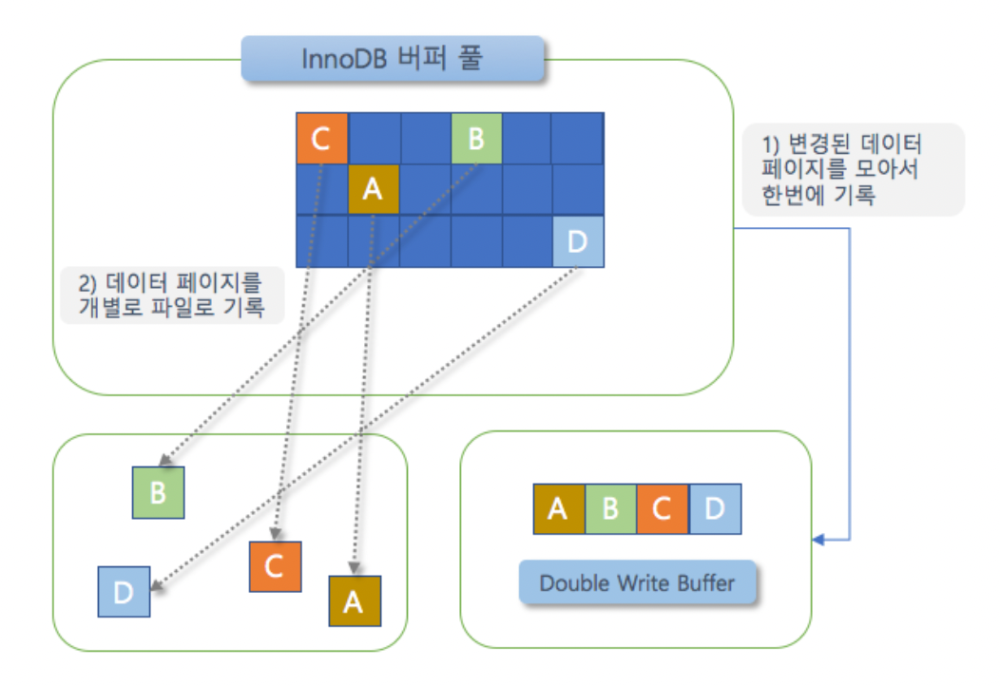

# 04. 아키텍처 (2)

날짜: 2022/07/20  
분류: 정리  
설명: Real Mysql 2번째 스터디 수요일 리딩  
페이지: 108 ~ 141  
[Notion Link](https://namkyung2.notion.site/04-2-3207e3d199ee4aaeb0481bc241f266a8)

### # InnoDB 버퍼 풀

- InnoDB 스토리지 엔진에서 가장 핵심적인 부분
- 디스크의 **데이터 파일이나 인덱스 정보를 메모리에 캐시해 두는 공간**
- **쓰기 작업을 지연**시켜 일괄 작업으로 처리할 수 있게 해주는 버퍼 역할
  - 변경된 데이터를 모아서 처리하면 **랜덤한 디스크 작업의 횟수를 줄일 수 있다**

**버퍼 풀의 크기 설정**

- 전체 물리 메모리의 **80%** ? → 그렇게 단순한게 아니다 !
  - InnoDB 버퍼 풀의 크기를 적절히 작은 값으로 설정해서 조금씩 증가시키는 방법이 최적
  - OS 메모리 공간이 8GB 미만이라면 50%정도만 설정, 8GB 이상이면 전체 메모리 50%부터 시작
- 버퍼 풀 전체를 관리하는 세마포어로 인해 **내부 잠금 경합**을 많이 유발시켰다
  - **개선을 위해 버퍼 풀을 여러 개로 쪼개어 관리할 수 있게 됐다**
  - 기본적으로 버퍼 풀 인스턴스의 개수는 8개로 초기화 , 1GB미만일 경우 1개만 생성
  - 메모리 공간이 40GB 이하면 기본값 유지, 메모리가 크다면 버퍼 풀 인스턴스 당 5GB 정도가 되게 설정

**버퍼 풀의 구조**

- InnoDB 스토리지 엔진은 버퍼 풀이라는 **거대한 메모리 공간을 페이지 크기의 조각으로 쪼개어**
  필요로 할 때 해당 페이지를 읽어 각 조각에 저장한다
- **LRU (Least Recently Used) 리스트, Flush 리스트 , Free 리스트**

  - Free 리스트 → 사용자의 쿼리가 **새롭게 디스크의 데이터 페이지를 읽어와야 하는 경우** 사용
  - LRU 리스트
    - 디스크로부터 한 번 읽어온 페이지를 최대한 **오랫동안 InnoDB 버퍼 풀의 메모리에 유지**해서
      **디스크 읽기를 최소화**하는 것이 목적
  - Flush 리스트
    - 디스크로 동기화되지 않은 데이터를 가진 데이터 페이지의 **변경 시점** 기준의 페이지 목록을 관리
  - **InnoDB 스토리지 엔진에서 데이터를 찾는 과정**

    1. 필요한 레코드에 대한 저장된 데이터 페이지가 **버퍼 풀에 있는 지 검사**

       - **InnoDB Adaptive Hash Index**를 이용해 페이지 검색
       - 해당 테이블의 인덱스(B-Tree)를 이용해 버퍼 풀에서 페이지 검색
       - 버퍼 풀에 이미 데이터 페이지가 있었다면 해당 페이지의 포인터를 MRU 방향으로 승급

    2. 디스크에서 필요한 데이터 페이지를 버퍼 풀에 적재하고, 적재된 페이지에 대한 포인터를 LRU 헤더 부분에 추가

    3. 버퍼 풀의 LRU 헤더 부분에 적재된 데이터 페이지가 실제로 읽히면 MRU 헤더 부분으로 이동

    4. 버퍼 풀에 있는 데이터 페이즈는 사용자 쿼리가 얼마나 최근에 접근했었는 지에 따라 Age 부여,
       오랫동안 사용되지 않으면 버퍼 풀에서 제거

    - Eviction → 버퍼 풀에서 데이터 페이지를 삭제해 추가 공간을 확보하는 작업

    5. 필요한 데이터가 자주 접근됐다면 해당 페이지의 인덱스 키를 Adaptive Hash Index에 추가
       >

  - 데이터가 변경되면 InnoDB는 변경 내용을 리두 로그에 기록하고 버퍼 풀의 데이터 페이지에도
    변경 내용 반영

**버퍼 풀과 리두 로그**

- InnoDB 버퍼 풀은 데이터베이스 서버의 성능 향상을 위해 **데이터 캐시와 쓰기 버퍼링**이라는 두 가지 용도
  - 버퍼 풀의 메모리 공간만 단순히 늘리는 것은 데이터 캐시 기능만 향상
  - **클린 페이지** → 디스크에서 읽은 상태로 전혀 변경되지 않은 페이지
  - **더티 페이지** → CRD 명령으로 변경된 데이터를 가진 페이지
  - 데이터 변경이 계속 발생하면 리두 로그 파일에 기록됐던 로그 엔트리는 어느 순간 다시 새로운 로그 엔트리로 덮어 쓰인다
  - InnoDB 버퍼 풀의 더티 페이지는 특정 리두 로그 엔트리와 관계를 가지고, 체크포인트가 발생하면 체크포인트 LSN보다 작은 리두 로그 엔트리와 관련된 더티 페이지는 모두 디스크로 동기화
  - 리두 로그는 변경부분만 가지고 버퍼 풀은 데이터 페이지를 전부 가지기 때문에
    데이터 변경이 발생해도 리두 로그는 훨씬 작은 공간만 있으면 된다

**버퍼 풀 플러시**

- 8버전으로 업그레이드 되면서 더티 페이지를 디스크에 동기화하는 부분에서 예전과 같은 디**스크 쓰기 폭증 현상**은 발생하지 않았다
- 버퍼 풀에서 아직 디스크로 기록되지 않은 더티 페이지들을 성능상의 악영향 없이 디스크에 동기화하기 위해
  **2개의 플러시 기능을 백그라운드**로 실행 - **Flush 리스트 플러시** - 리두 로그 공간의 재활용을 위해 주기적으로 오래된 리두 로그 엔트리가 사용하는 공간을 비워야 함 - 이때, 반드시 InnoDB 버퍼 풀의 더티 페이지가 먼저 디스크로 동기화돼야 한다 - Flush 리스트 함수를 호출해서 Flush 리스트에서 오래전에 변경된 데이터 페이지 순서대로
  디스크에 동기화하는 작업을 수행한다 - 클리너 스레드 → 더티 페이지를 디스크로 동기화하는 스레드 - 가능한 innodb_page_cleaners와 innodb_buffer_pool_instances 값은 동일하게 ! - 클린 페이지 뿐만 아니라 사용자의 CRD에 의해 변경된 더티 페이지도 함께 가지고 있다 - 전체 버퍼 풀이 가진 페이지의 90%까지 더티 페이지를 가질 수 있다 - 버퍼 풀은 더티 페이지를 많이 가지고 있을수록 여러 번의 디스크 쓰기를 한 번으로 줄이는
  효과를 극대화할 수 있다 - 더티 페이지가 많으면 많을수록 디스크 쓰기 폭발 현상이 발생할 가능성이 높아진다 - **Adaptive Flush 기능**

              innodb_io_capacity , innodb_io_capacity_max 설정값에 의존하지 않고
              새로운 알고리즘을 사용한다

              **리두 로그의 증가 속도를 분석해서 적절한 수준의 더티 페이지가 버퍼 풀에 유지될 수 있도록 디스크 쓰기를 실행한다**

      - **LRU 리스트 플러시**
          - LRU 리스트에서 **사용 빈도가 낮은 데이터 페이지들을 제거해서 새로운 페이지들을 읽어올 공간을
          만들어야 하는데**, 이를 위해 LRU 리스트 플러시 함수가 사용된다
          - LRU 리스트의 끝부분부터 시작해서 설정된 개수만큼 페이지 스캔
              - 스캔하면서 더티 페이지는 디스크에 동기화, 클린 페이지는 Free 리스트로 옮긴다
          - LRU 리스트 스캔 수 = innodb_buffer_pool_instances * innodb_lru_scan_depth

**버퍼 풀 상태 백업 및 복구**

- 수동으로 복구 작업을 하기는 쉽지 않다
  - InnoDB 스토리지 엔진은 MySQL 서버가 **Shutdown되기 직전에 버퍼 풀의 백업을 실행**하고
    재시작되면 백업된 버퍼 풀의 상태를 복구할 수 있는 기능을 제공

**버퍼 풀의 적재 내용 확인**

- information_schema 데이터베이스에 innodb_cached_indexes 테이블
  - 테이블의 인덱스별로 데이터 페이지가 얼마나 InnoDB 버퍼 풀에 적재돼 있는 지 알 수 있다

### # Double Write Buffer

- 리두 로그는 로그 공간의 낭비를 막기 위해 페이지의 변경된 내용만을 기록한다
  - 더티 페이지를 디스크 파일로 플러시 할 때 일부만 기록되는 문제가 발생하면 복구 불가 할 수도 있다
    - Partial-page , Torn-page
      - Sol) **‘ Double-Write ‘** 기법 - 더티 페이지를 우선 묶어 한 번의 디스크 쓰기로 **시스템 테이블스페이스의
        DoubleWrite 버퍼에 기록**한다
        
    - **A , B 페이지는 정상 기록, C 페이지 기록 도중에 OS가 비정상적으로 종료**
      InnoDB 스토리지 엔진은 재시작될 때 항상 DoubleWrite 버퍼의 내용과 데이터 파일의 페이지들을 모두 비교해서 다른 내용을 담고 있는 페이지가 있으면 DoubleWrite 버퍼의 내용을 데이터 파일의 페이지로 복사한다

### # Undo Log

- InnoDB 스토리지 엔진은 트랜잭션과 격리 수준을 보장하기 위해 CRD로 변경되지 이전 버전의 데이터를
  별도로 백업한다

**Undo Log 레코드 모니터링**

- **트랜잭션의 롤백 대비용**
  - 이전 스터디에서 UPDATE 쿼리가 실행되고 커밋되지 않고 롤백되는 상황을 생각해보자
- **트랜잭션의 격리 수준을 유지하면서 높은 동시성을 제공**
  - 5장에서 자세하게 만나요 ~

**Undo 테이블스페이스 관리**

- Undo 로그가 저장되는 공간

  - 8.0 업그레이드 되면서 Undo 로그는 **항상 시스템 테이블스페이스 외부의 별도 로그 파일에 기록**

- **Undo tablespace truncate**
  Undo 테이블스페이스 공간을 필요한 만큼만 남기고 불필요하거나 과도하게 할당된 공간을 OS로 반납

### **# 체인지 버퍼**

- RDBMS에서 레코드가 **INSERT**되거나 **UPDATE**될 때는 데이터 파일을 변경하는 작업뿐 아니라
  해당 테이블에 포함된 인덱스를 업데이트 하는 작업도 필요하다 - **UPDATE는 랜덤하게 디스크를 읽는 작업이 필요하므로 테이블에 인덱스가 많다면
  상당히 많은 자원을 소모하게 된다** - InnoDB는 변경해야 할 인덱스 페이지가 버퍼 풀에 있으면 바로 업데이트 수행 - 그렇지 않으면 임시 공간에 저장해두고 사용자에게 결과를 반환하는 형태 - **임시 메모리 공간을 ‘체인지 버퍼'** 라고 한다 - 사용자에게 결과 전달하기 전에 **반드시 중복 여부 체크**해야 하는 **유니크 인덱스**는 체인지 버퍼 사용 불가

### # Redo 로그 및 로그 버퍼

- Redo 로그는 ACID 중 **Durable**과 가장 밀접하게 연관
  - 비정상 종료됐을 때 데이터를 잃지 않게 해주는 **안전장치**

> **대부분의 데이터베이스 서버는 데이터 변경 내용을 로그로 먼저 기록한다**

> 대부분의 DBMS에서 데이터 파일은 쓰기보다 읽기 성능을 고려한 자료 구조를 가지고 있다
> 이로 인한 성능 저하를 막기 위해 데이터베이스 서버는 쓰기 비용이 낮은 자료구조를 가진
> 리두 로그를 가지고 있다

- **MySQL 서버가 비정상 종료되는 경우 InnoDB 스토리지 엔진의 데이터 파일은 두 가지의
  일관되지 않은 데이터를 가질 수 있다** 1. 커밋됐지만 데이터 파일에 기록되지 않은 데이터 - 리두 로그에 저장된 데이터를 데이터 파일에 다시 복사하기만 하면 된다 2. 롤백됐지만 데이터 파일에 이미 기록된 데이터 - 변경되기 전 데이터를 가진 Undo 로그의 내용을 가져와 데이터 파일에 복사 - 변경에 대해 커밋됐는 지, 롤백됐는 지, 트랜잭션 실행 중간 상태인 지 확인하기 위해서
  Redo 로그가 필요하다

> **데이터베이스 서버에서 Redo 로그는 트랜잭션이 커밋되면 즉시 디스크로 기록되도록 시스템 변수를
> 설정하는 것을 권장한다**

→ 비정상 종료 시, 직전까지의 트랜잭션 커밋 내용이 Redo 로그에 기록될 수 있고 복구가 가능해진다

### # Redo 로그 아카이빙

- 데이터 변경이 많아서 Redo 로그가 덮어쓰인다고 하더라도 백업이 실패하지 않게 해준다

### # Adaptive Hash Index

- 사용자가 수동으로 생성하는 인덱스가 아니라 InnoDB 스토리지 엔진에서 **사용자가 자주 요청하는 데이터에 대해 자동으로 생성하는 인덱스**
  - **B-Tree 검색 시간을 줄여주기 위해 도입된 기능**
    - 자주 읽히는 데이터 페이지의 키 값을 이용해 해시 인덱스를 만들고, 필요할 때마다
      Adaptive Hash Index를 검색해서 레코드가 저장된 데이터 페이지를 즉시 찾아갈 수 있다 - B-Tree를 루트 노드부터 리프 노드까지 찾아가는 비용을 없애고 CPU는 적은 일을 하게 해준다 - 쿼리 성능도 빨라진다
  - 데이터 페이지를 버퍼 풀 내에서 접근하는 것을 더 빠르게 만드는 기능
  - 테이블의 삭제 작업에 많은 영향을 끼친다
    - 테이블의 인덱스가 Adaptive Hash Index에 적재돼 있을 때, 테이블을 삭제하거나 변경하면 ?

>
