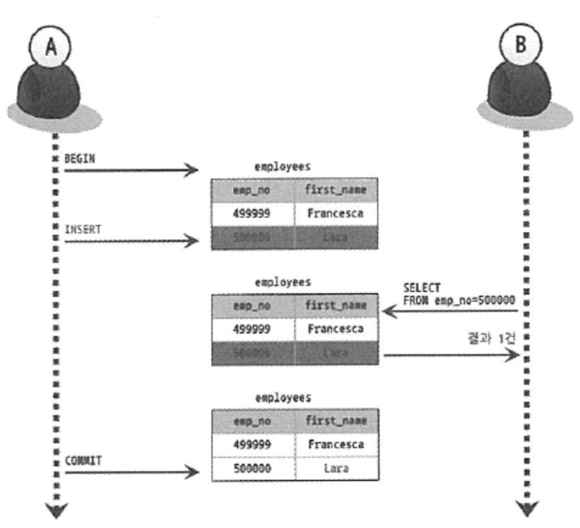

# 05. 트랜잭션 (2)

날짜: 2022/08/10
분류: 정리
설명: Real Mysql 5번째 스터디 수요일 리딩 & 토론
페이지: 166 ~ 183

# InnoDB 스토리지 엔진 잠금

- InnoDB 스토리지 엔진은 레코드 기반 잠금의 기능 제공
  - 레코드 락이 페이지 락, 테이블 락으로 레벨업 **(락 에스컬레이션)**이 없다
  - 레코드와 레코드 사이의 간격을 잠그는 **갭(GAP)**이라는 락이 존재
    > InnoDB 스토리지 엔진은 레코드 자체가 아니라 인덱스의 **레코드를 잠근다**
    > 인덱스가 하나도 없는 테이블이더라도 내부적으로 자동 생성된
    > 클러스터 인덱스를 이용해 잠금을 설정한다

1. **갭 락**
   - 레코드와 레코드 사이의 간격에 새로운 레코드가 생성되는 것을 제어한다
2. **넥스트 키 락**
   - 레코드 락 + 갭 락
   - 바이너리 로그에 기록되는 쿼리가 레플리카 서버에서 실행될 때 소스 서버에서 만들어 낸 결과와 동일한 결과를 만들어내도록 보장하는 것이 주목적
     - 넥스트 키 락과 갭 락으로 인해 데드락이 발생하거나 다른 트랜잭션을 기다리게 하는 일이 자주 발생
       - 가능하다면 바이너리 로그 포맷을 ROW 형태로 바꿔서 넥스트 키 락이나 갭 락을 줄이자
3. **자동 증가 락**
   - AUTO_INCREMENT 시 중복되지 않고 저장된 순서대로 증가하는 일련번호 값을 가지게 하기 위한 락

# 인덱스와 잠금

- InnoDB의 잠금은 레코드를 잠그는 것이 아니라 **인덱스를 잠그는 방식**으로 처리된다
  - **변경해야 할 레코드를 찾기 위해 검색한 인덱스의 레코드를 모두 락을 걸어야 한다**
    > employees 테이블에는 first_name만 멤버로 담긴 ix_firstname이라는 인덱스가 있다
    > SELECT COUNT(\*) FROM employees WHERE first_name=’Georgi’;
    > → 253
    > SELECT COUNT(\*) FROM employees WHERE first_name=’Georgi’ AND last_name=’Klassen’;
    > → 1
    > UPDATE employees SET hire_date=NOW() WHERE first_name=’Gerogi’ AND last_name=’Klassen’;
    > Q) **UPDATE 문장이 실행되면 1건의 레코드가 업데이트 될 것이다.**
    > 하지만, 1건의 업데이트를 위해 몇 개의 레코드에 락을 걸어야 할까?
    > → **253건의 레코드가 모두 잠긴다**
    > Q) **테이블에 인덱스가 하나도 없다면 어떻게 될까?**
    > → 테이블을 풀 스캔하면서 UPDATE 작업을 하는데, 모든 레코드를 잠그게 된다

# 레코드 수준의 잠금 확인 및 해제

- 레코드 수준의 잠금은 테이블의 레코드 각각에 잠금이 걸리므로 레코드가 자주 사용되지 않는다면
  오랜 시간 동안 잠겨진 상태로 남아 있어도 잘 발견되지 않는다

> UPDATE 명령 3개가 실행된 상태의 프로세스 목록을 생각해보자

mysql> SHOW PROCESSLIST;
17 . . . \_
18 . . . updating
19 . . . updating

17번 스레드는 아무것도 하지 않고 있지만 트랜잭션을 시작하고 UPDATE 명령 실행이 완료되고
COMMIT을 실행하지 않은 상태이므로 업데이트한 레코드 잠금을 그대로 가지고 있다

18번 스레드는 다음으로 UPDATE 명령을 실행
19번 스레드는 그 이후에 UPDATE 명령을 실행

performance_schema의 data_locks 테이블과 data_lock_wiats 테이블을 조인해서 잠금 대기 순서를 살펴보자

18번, 19번 스레드는 현재 대기 중인 스레드
17번 스레드가 가지고 있는 잠금을 해제하고, 18번 스레드가 그 잠금을 획득하고 UPDATE를 완료한 후 잠금을 풀어야만 비로소 19번 스레드가 UPDATE를 실행할 수 있음을 의미한다

>

# MySQL의 격리 수준

- 여러 트랜잭션이 동시에 처리될 때 특정 트랜잭션이 다른 트랜잭션에서 변경하거나 조회하는 데이터를 볼 수 있게 허용할 지 말지를 결정하는 것이다
- **READ UNCOMMITTED , READ COMMITTED , REPEATABLE READ , SERIALIZABLE**
  - READ UNCOMMITTED = DIRTY READ , SERIALIZABLE 사용 X
  - SERIALIZABLE 격리 수준이 아니라면 크게 성능의 개선이나 저하는 발생하지 않는다

1. **READ UNCOMMITTED**

   - 각 트랜잭션에서의 변경 내용이 COMMIT이나 ROLLBACK 상관없이 다른 트랜잭션에서 보인다
     - 다른 사용자가 INSERT한 정보가 커밋되지 않은 상태에서도 조회할 수 있다
     - 데이터가 나타났다가 사라졌다 하는 현상을 초래
       

1. **READ COMMITTED**

   

   - 오라클 DBMS에서 기본으로 사용되는 격리 수준, 온라인 서비스에서 가장 많이 선택
   - **COMMIT이 완료된 데이터만 다른 트랜잭션에서 조회할 수 있다**
     - 사용자 A가 이름 데이터를 L에서 NK로 변경했는데, 새로운 데이터(NK)는 테이블에 즉시 기록되고 이전 값(L)은 언두 영역으로 백업된다
     - 이 데이터를 SELECT하면 테이블이 아니라 언두 영역에 백업된 레코드에서 가져온다
   - **REPEATABLE READ 정합성에 어긋난다 (NON-REPEATABLE READ)**
     - 하나의 트랜잭션 내에서 똑같은 SELECT 쿼리를 실행했을 때는 항상 같은 결과를 가져와야 한다
       

1. **REPEATABLE READ**

   

   - **MySQL의 InnoDB 스토리지 엔진에서 기본적으로 사용되는 격리 수준**
   - 바이너리 로그를 가진 MySQL 서버에서는 최소 REPEATABLE READ 격리 수준 이상을 사용
     - **NON-REPEATABLE READ 부정합이 발생하지 않는다**
     - 변경되기 전 레코드를 **언두 공간에 백업**해두고 실제 레코드 값을 변경 **( MVCC )**
       > REPEATABLE READ와 READ COMMITTED의 차이는 언두 영역에 백업된 레코드의
       > 여러 버전 가운데 몇 번째 이전 버전까지 찾아 들어가야 하느냐에 있다
       > 모든 InnoDB의 트랜잭션은 고유한 트랜잭션 번호를 가지며, 언두 영역에 백업된 모든 레코드에는 변경을 발생시킨 트랜잭션의 번호가 포함돼 있다
       > REPEATABLE READ 격리 수준에서는 MVCC를 보장하기 위해 트랜잭션 가운데 가장 오래된 트랜잭션 번호보다 트랜잭션 번호가 앞선 언두 영역의 데이터는 삭제할 수 없다

1. **SERIALIZABLE**
   - 가장 단순한 격리 수준이며 가장 엄격한 격리 수준
     - 읽기 작업도 공유 잠금을 획득해야만 하며, 다른 트랜잭션은 그 레코드를 변경하지 못한다
