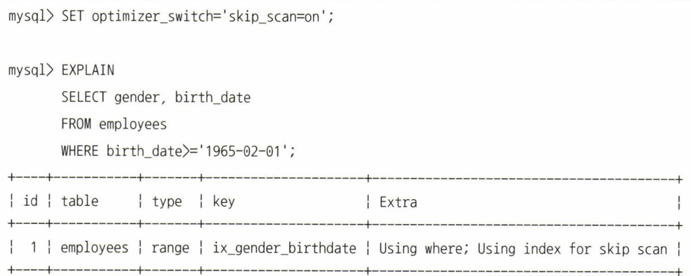
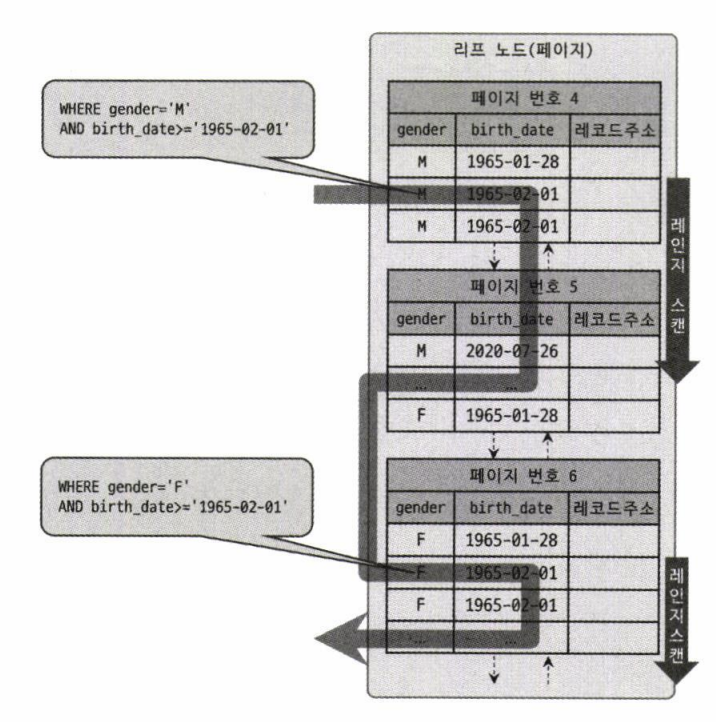
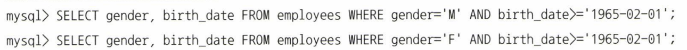

# 06. 인덱스 (1)

날짜: 2022/08/11
분류: 정리
설명: Real Mysql 6번째 스터디 목요일 리딩
페이지: 214 ~

# 인덱스

칼럼의 값과 해당 레코드가 저장된 주소를 키와 값의 쌍으로 삼아 인덱스를 만들어 둔다

DBMS의 인덱스는 칼럼의 값을 주어진 순서로 미리 정렬해서 보관한다

### 인덱스와 데이터 파일

1. **SortedList**

   - DBMS의 인덱스와 같은 자료 구조
   - 저장되는 값을 항상 정렬된 상태로 유지하는 자료구조
     - 저장될 때마다 항상 값을 정렬해야하는 단점
     - 이미 정렬돼 있어 아주 빨리 원하는 값을 찾아올 수는 장점
     - DBMS에서는 저장 성능을 희생하고 읽기 속도를 높인다

1. **ArrayList**
   - 데이터 파일과 같은 자료 구조
   - 저장되는 순서 그대로 유지하는 자료 구조

### B-Tree 인덱스

데이터베이스의 인덱싱 알고리즘 가운데 가장 일반적으로 사용되고 가장 먼저 도입된 알고리즘

- 트리 구조의 최상위에 하나의 루트 노드가 존재하고 그 하위에 자식 노드가 붙어 있는 형태이다
- 인덱스의 리프 노드는 항상 실제 데이터 레코드를 찾아가기 위한 주솟값을 가지고 있다
  - **MySQL 리프 노드의 Value는 PK이다**
- 인덱스의 키 값은 모두 정렬돼 있지만, 데이터 파일의 레코드는 정렬돼 있지 않고 임의의 순서로 저장된다
  - 레코드가 삭제되어 빈 공간이 생기면 그 다음의 INSERT는 가능한 삭제된 공간을 재활용하도록
    DBMS가 설계되기 때문에 항상 INSERT된 순서로 저장되는 것은 아니다

> InnoDB 테이블에서 레코드는 클러스터되어 디스크에 저장되므로 기본적으로 PK 순서로 정렬되어 저장
> 다른 DBMS에서는 클러스터링 기능이 선택 사항

클러스터링은 **비슷한 값**을 최대한 모아서 저장하는 방식을 의미한다

>

- MyISAM와 InnoDB 스토리지 엔진의 인덱스에서 가장 큰 차이점
  세컨더리 인덱스를 통해 데이터 파일의 레코드를 찾아가는 방법
  MyISAM 테이블은 세컨더리 인덱스가 물리적인 주소를 가진다
  InnoDB 테이블은 PK를 주소처럼 사용하기 때문에 논리적인 주소를 가진다
  **InnoDB 테이블에서는 인덱스를 통해 레코드를 읽을 때 데이터 파일을 바로 찾아가지 못한다**
  **InnoDB 스토리지 엔진에서는 모든 세컨더리 인덱스 검색에서 데이터 레코드를 읽기 위해서는
  반드시 PK를 저장하고 있는 B-Tree를 다시 한번 검색해야 한다**

### B-Tree 인덱스 키 추가 및 삭제

테이블의 레코드를 저장하거나 변경하는 경우 인덱스 키 추가나 삭제 작업이 발생한다

1. **키 추가**
   - MyISAM이나 MEMORY 스토리지 엔진은 INSERT 문장이 실행되면 즉시 새로운 키 값 추가
   - InnoDB 스토리지 엔진은 지능적으로 지연시켜 나중에 처리할 수 있다
     - PK나 유니크 인덱스의 경우 중복 체크가 필요하기 때문에 즉시 B-Tree에 추가하거나 삭제한다
     - 체인지 버퍼 참고
2. **키 삭제**

   - 해당 키 값이 저장된 B-Tree의 리프 노드를 찾아서 삭제 마크만 하면 작업 완료
     - 삭제 마킹된 인덱스 키 공간은 계속 그대로 방치하거나 재활용할 수 있다

3. **키 변경**
   - B-Tree의 키 값 변경 작업은 키 값을 먼저 삭제한 후, 다시 새로운 키 값을 추가하는 형태다
     - 체인지 버퍼를 활용해 지연 처리될 수 있다
4. **키 검색**
   - 트리 탐색
   - 인덱스의 키 값에 변형이 가해진 후 비교되는 경우에는 B-Tree의 빠른 검색 기능을 사용할 수 없다
   - InnoDB 테이블에서 지원하는 레코드 잠금이나 넥스트 키락이 검색을 수행한 인덱스를 잠근 후
     테이블의 레코드를 잠그는 방식으로 구현돼 있다 - UPDATE , DELETE 문장이 실행될 때 적절한 인덱스가 없으면 불필요하게 많은 레코드를 잠근다

### B-Tree 인덱스 사용에 영향을 미치는 요소

인덱스를 구성하는 컬럼의 크기, 레코드의 건수, 유니크한 인덱스 키 값의 개수등에 의해 검색이나 변경 작업의 성능이 영향을 받는다

1. 인덱스 키 값의 크기
   - 인덱스도 페이지 단위로 관리되며, 리프 노드를 구분한 기준이 바로 페이지 단위이다
   - 리프 노드를 구분한 기준이 페이지 단위다
   - B-Tree 자식 노드는 인덱스의 페이지 크기와 키 값의 크기에 따라 결정된다
     - InnoDB 스토리지 엔진의 페이지 크기는 기본적으로 16KB
     - 인덱스의 키가 16바이트 , 자식 노드 주소 영역이 12바이트
       - 하나의 인덱스 페이지(16KB)에 몇 개의 키를 저장할 수 있을까 ?
         → 16 \* 1024 / ( 16 + 12 ) = 585
         → 인덱스의 키 값의 길이가 길어진다는 것은 전체적인 인덱스의 크기가 커진다는 의미
2. B-Tree 깊이

   - B-Tree 깊이가 3인 경우
     - 키 값이 16바이트일 때, 585 _ 585 _ 585 = 최대 2억개 정도의 키 값을 담을 수 있다
     - 키 값이 32바이트일 때, 5천만개로 줄어든다
       - B-Tree의 깊이는 MySQL에서 값을 검색할 때 몇 번이나 랜덤하게 디스크를 읽어야 하는 지와
         직결되는 문제이다
       - 아무리 대용량 DB라도 B-Tree 깊이가 5단계 이상까지 깊어지는 경우는 흔치 않다

3. 선택도 (기수성)

   - Selectivity , Cardinality
     - 인덱스 키 값 가운데 유니크한 값의 수를 의미한다
     - 전체 인덱스 키 값이 100개인데, 유니크한 값이 10개라면 기수성은 10이다
   - 인덱스는 선택도가 높을수록 검색 대상이 줄어들기 때문에 그만큼 빠르게 처리된다

   - **케이스 예시**
     tb_test 테이블의 전체 레코드 수는 1만 건, country 칼럼만으로 인덱스가 생성된 경우
     케이스 A : country 칼럼의 유니크한 값의 개수가 10개
     케이스 B : country 칼럼의 유니크한 값이 개수가 1000개
     SELECT \* FROM tb_test WHERE country=’KOREA’ AND city=’SEOUL’
     A케이스의 경우 평균 1,000건 , B 케이스의 경우 평균 10건이 조회될 수 있다는 것을
     인덱스의 통계 정보로 예측할 수 있다
     실제 모든 조건을 만족하는 레코드가 단 1건이라면 ?
     A 케이스는 1건을 위해 쓸모없는 999건의 레코드를 더 읽은 것이다
     B 케이스는 9건만을 더 읽은 것이다

4. 읽어야 하는 레코드 건수
   - 테이블에 100만 건의 레코드가 있는데, 50만 건을 읽어야하는 쿼리가 있다고 생각해보자
     - 모두 읽어 50만 건을 버리는 것이 효율적일까 ?
     - 인덱스를 통해 50만 건만 읽어 오는 것이 효율적일까 ?
       - 일반적으로 DBMS의 옵티마이저에서는 인덱스를 통해 레코드 1건을 읽는 것이
         테이블에서 직접 레코드 1건을 읽는 것보다 4~5배 정도 비싼 비용으로 생각한다
         > 인덱스를 통해 읽어야 할 레코드의 건수가 전체 테이블의 레코드 20~25%를 넘어서면
         > 인덱스를 이용하지 않고 테이블을 모두 직접 읽어서 필요한 레코드만 가려내는 방식이 효율적이다

### B-Tree 인덱스를 통한 데이터 읽기

1. 인덱스 레인지 스캔
   - 가장 대표적인 접근 방식
   - 검색해야 할 인덱스의 범위가 결정됐을 때 사용하는 방식
   - SELECT \* FROM employees WHERE first_name BETWEEN ‘Ebbe’ AND ‘Gad’
     - 인덱스 탐색을 통해 조건을 만족하는 값이 저장된 위치를 찾는다
     - 필요한 만큼 인덱스를 차례대로 쭉 읽는다 ( 인덱스 스캔 )
     - 인덱스 키와 레코드 주소를 이용해 레코드가 저장된 페이지를 가져오고 최종 레코드를 읽어온다
       - 데이터 레코드를 읽기 위해 랜덤 I/O가 최대로 조건에 만족하는 레코드 수만큼 일어난다
       - 커버링 인덱스
         - 커버링 인덱스로 처리되는 쿼리는 디스크의 레코드를 읽지 않아도 되기 때문에
           랜덤 읽기가 상당히 줄어들고 성능은 빨라진다
2. 인덱스 풀 스캔
   - 인덱스의 처음부터 끝까지 모두 읽는 방식
   - 쿼리의 조건절에 사용된 칼럼이 인덱스의 첫 번째 칼럼이 아닌 경우 사용된다
     - 인덱스는 A B C 순서로 만들어져있지만, 조건절은 B 칼럼이나 C 칼럼으로 검색하는 경우
     - 인덱스 리프 노드의 제일 앞 또는 제일 뒤로 이동한 후, 인덱스의 리프 노드를 연결하는
       링크드 리스트를 따라서 처음부터 끝까지 스캔하는 방식 - 레인지 스캔보다는 비효율적이지만 테이블 풀 스캔보단 효율적
3. 루스 인덱스 스캔

   - 느슨하게 , 듬성듬성 인덱스를 읽는 것을 의미한다
   - 중간에 필요치 않은 인덱스 키 값은 무시하고 다음으로 넘어가는 형태
     - GROUP BY , 집합 함수 가운데 MAX, MIN 함수에 대해 최적화하는 경우 사용한다

4. 인덱스 스킵 스캔

   - MySQL 8.0부터는 옵티마이저가 gender 칼럼을 건너뛰어서 birth_date 칼럼만으로도 인덱스 검색이 가능하게 해주는 인덱스 스킵 스캔 최적화 기능이 도입됐다
     - MySQL 옵티마이저는 우선 gender 칼럼에서 유니크한 값을 모두 조회해서 주어진 쿼리에 gender 칼럼의 조건을 추가해서 쿼리를 다시 실행하는 형태로 처리한다

   

   

   

   - 인덱스 스킵 스캔의 단점
     - WHERE 조건절에 조건이 없는 인덱스의 선행 칼럼의 **유니크한 값의 개수가 적어야 한다**
     - 쿼리가 인덱스에 존재하는 칼럼만으로 처리 가능해야한다
