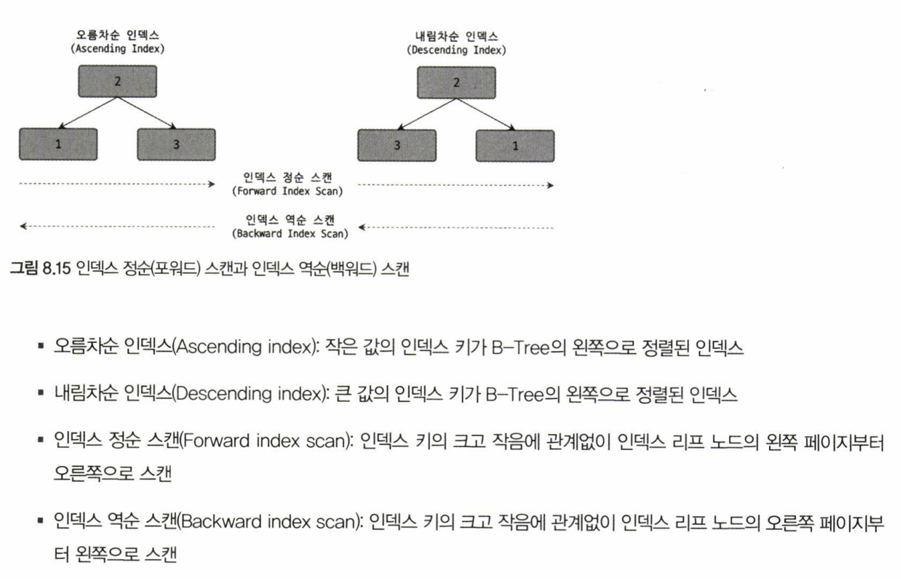
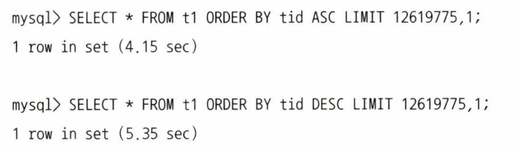

# 06. 인덱스 (2)

날짜: 2022/08/18
분류: 정리
설명: Real Mysql 8번째 스터디 목요일 리딩 & 토론
페이지: 240 ~ 252

### 다중 컬럼 인덱스

두 개 이상의 칼럼으로 구성된 인덱스를 다중 칼럼 인덱스라고 한다

> 칼럼이 4개인 인덱스를 생성한다면
> 세 번째 칼럼은 두 번째 칼럼에 의존해서 정렬되고 네 번째 칼럼은 다시 세 번째 칼럼에 의존해서 정렬된다

다중 칼럼 인덱스에서는 인덱스 내에서 각 칼럼의 순서가 상당히 중요

### B-Tree 인덱스의 정렬 및 스캔 방향

인덱스를 생성할 때 설정한 규칙에 의해 인덱스의 키 값은 오름차순 또는 내림차순으로 정렬되어 저장된다

인덱스를 어느 방향으로 읽을지는 쿼리에 따라 옵티마이저가 실시간으로 만들어 내는 실행 계획에 따라 결정된다

1. 인덱스의 정렬

   - MySQL 8.0부터는 정렬 순서를 **혼합한 인덱스**도 생성 가능
     - CREATE INDEX ix_teamname_userscore ON employess (team_name ASC, user_score DESC)

1. 인덱스의 스캔 방향

   - 인덱스 생성 시점에 오름차순 또는 내림차순으로 정렬이 결정되지만 쿼리가 그 인덱스를 사용하는 시점에 인덱스를 읽는 방향에 따라 오름차순 또는 내림차순 정렬 효과를 얻을 수 있다
   - **예시**
     1. SELECT \* FROM employees WHERE first_name ≥ ‘Lee’ ORDER BY first_name ASC LIMIT 4;
        → first_name 칼럼에 정의된 인덱스를 이용해 Lee라는 레코드를 찾은 후, 순서대로 4개의 레코드만 가져오면 된다
     1. SELECT \* FROM employees ORDER BY first_name DESC LIMIT 5;
        → employees 테이블의 first_name 칼럼에 정의된 인덱스를 역순으로 읽으면서 5개의 레코드만 가져오면 된다

1. 내림차순 인덱스
   - 2개 이상의 칼럼으로 구성된 복합 인덱스에서 각각의 칼럼이 ASC, DESC 혼합된 경우에는 내림차순 인덱스로만 해결 가능
     
     
     **정순 , 역순 비교**
     - **인덱스 역순 스캔이 인덱스 정순 스캔에 비해 느릴 수 밖에 없는 이유**
       InnoDB 스토리지 엔진에서 정순 스캔과 역순 스캔은 페이지 간의 양방향 연결 고리를 통해 전진하느냐 후진하느냐 차이
       이유 1. 페이지 잠금이 인덱스 정순 스캔에 적합한 구조이다
       이유 2. 페이지 내에서 인덱스 레코드가 단방향으로만 연결된 구조

### B-Tree 인덱스의 가용성과 효율성

쿼리의 WHERE 조건이나 GROUP BY, ORDER BY 절이 어떤 경우에 인덱스를 사용할 수 있고 어떤 방식으로 사용할 수 있는 지 식별할 수 있어야 한다

1. 비교 조건의 종류와 효율성

   - SELECT \* FROM dept_emp WHERE dept_no=’d002’ AND emp_no ≥ 10114;
     - 케이스 A : INDEX (dept_no, emp_no)
       - WHERE 절을 만족하는 레코드를 찾고 dept_no가 ‘d002’가 아닐 때 까지 쭉 읽으면 된다
     - 케이스 B : INDEX (emp_no, dept_no)
       - WHERE 절을 만족하는 레코드를 찾고, 그 이후 모든 레코드에 대해 dept_no가 ‘d002’인지 비교하는 과정 필요

   > A 케이스에서의 두 조건과 같이 작업의 범위를 결정하는 조건을
   > ’작업 범위 결정 조건'이라고 한다

   B 케이스와 같이 작업의 범위를 줄이지 못하고 거름종이 역할만 하는 조건을 ‘필터링 조건' , ‘체크 조건'이라고 한다

   >

2. 인덱스의 가용성
   - B-Tree 인덱스의 특징은 왼쪽 값에 기준해서 오른쪽 값이 정렬
     - 왼쪽이란 하나의 칼럼 내에서뿐만 아니라 다중 칼럼 인덱스에도 적용
       - 케이스 A : INDEX (first_name)
       - 케이스 B : INDEX (dept_no, emp_no)
   - **케이스 A , 케이스 B 예시**
     1. 케이스 A
     - SELECT \* FROM employees WHERE first_name LIKE ‘%mer’;
       → 이 쿼리는 인덱스 레인지 스캔 방식으로 인덱스 이용 불가
       first_name 칼럼에서 저장된 값의 왼쪽부터 한 글자씩 비교하면서 일치하는 레코드를 찾아야 하는데 조건절에 주어진 상수값(’%mer’)에는 왼쪽 부분이 고정되지 않았기 때문이다
     1. 케이스 B
     - SELECT \* FROM dept_emp WHERE emp_no≥10144;
       → 인덱스의 선행 칼럼인 dept_no 조건 없이는 효율적으로 인덱스를 사용할 수 없다
