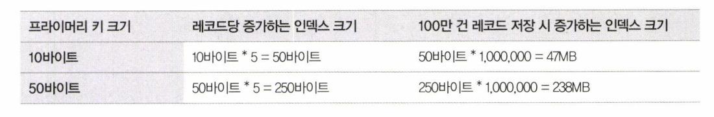

# 06. 인덱스 (3)

날짜: 2022/08/25
분류: 정리
설명: Real Mysql 10번째 스터디 목요일 리딩
페이지: 268 ~ 281

### 멀티 밸류 인덱스

하나의 데이터 레코드가 여러 개의 키 값을 가질 수 있는 형태의 인덱스

- 최근 RDBMS들이 **JSON 데이터 타입**을 지원하기 시작
  - JSON의 배열 타입의 필드에 저장된 원소들에 대한 인덱스 요건이 발생
- 다음 함수들을 이용해서 검색해야 옵티마이저가 인덱스를 활용한 실행 계획을 수립
  - MEMBER OF() , JSON_CONTAINS() , JSON_OVERLAPS()

### 클러스터링 인덱스

데이블의 레코드를 PK 기준으로 **비슷한 것들끼리 묶어서 저장하는 형태**, InnoDB 엔진에서만 지원

- PK의 키 값에 의해 레코드의 **저장 위치**가 결정된다
  - PK의 키 값이 변경된다면 그 레코드의 물리적인 저장 위치가 바뀌어야 한다
- InnoDB와 같이 항상 클러스터링 인덱스로 저장되는 테이블은 PK 기반의 검색이 매우 빠르다
  - 대신, 레코드의 저장이나 PK의 변경이 상대적으로 느리다
- **PK가 없는 InnoDB 테이블은 어떻게 클러스터링 테이블로 구성될까 ?**
  키가 없는 경우에는 InnoDB 스토리지 엔진이 다음 우선순위대로 대체할 칼럼을 선택한다
  1. NOT NULL 옵션의 유니크 인덱스 중 첫 번째 인덱스를 클러스터링 키로 선택
  2. 자동으로 유니크한 값을 가지도록 증가되는 칼럼을 내부적으로 추가한 후, 클러스터링 키로 선택
  3. 키 후보를 찾지 못하는 경우 내부적으로 레코드의 일련번호 칼럼을 생성한다
  → 키 후보를 찾지 못하면 아무 의미없는 값으로 클러스터링 된다
        가능하다면 PK를 명시적으로 생성하자 !

### 세컨더리 인덱스에 미치는 영향

- MyISAM, MEMORY 테이블 같은 클러스터링 되지 않은 테이블은 INSERT될 때 처음 저장된 공간에서
  절대 이동하지 않는다 - 데이터 레코드가 저장된 주소는 내부적인 **레코드 아이디(ROWID)** 역할을 한다 - PK나 세컨더리 인덱스의 각 키는 ROWID를 이용해 실제 데이터 레코드를 찾아온다 - 그래서 PK와 세컨더리 인덱스는 구조적으로 아무런 차이가 없다
- **InnoDB 테이블에서 세컨더리 인덱스가 실제 레코드가 저장된 주소를 가지고 있다면 ?**

  **클러스터링 키 값이 변경될 때마다 데이터 레코드의 주소가 변경되고 해당 테이블의 모든 인덱스에
  저장된 주솟값을 변경해야 한다**

  이런 오버헤드를 제거하기 위해
  **InnoDB 테이블의 모든 세컨더리 인덱스는 해당 레코드가 저장된 주소가 아니라 PK 값을 저장하도록 구현**

- **PK로 클러스터링된 InnoDB vs MyISAM**
  CREATE TABLE employees(
  emp_no INT NOT NULL,
  first_name VARCHAR(20) NOT NULL,
  PRIMARY KEY (emp_no),
  INDEX ix_firstname (first_name)
  );
  SELECT \* FROM employees WHERE first_name=’Aamer’;
  1. MyISAM

     - 인덱스를 검색해서 레코드의 주소 확인 후, 레코드의 주소를 이용해 최종 레코드를 가져온다

  1. InnoDB
     - **인덱스를 검색해 레코드의 PK 값을 확인한 후, PK 인덱스를 검색해서 최종 레코드를 가져온다**

### 클러스터링 인덱스의 장점과 단점

1. 장점
   - **PK 검색 빠르다**
     - 특히 PK를 범위 검색하는 경우 매우 빠르다
   - 테이블의 모든 세컨더리 인덱스가 PK를 가지고 있기 때문에 인덱스만으로 처리될 수 있는 경우가 많다
2. 단점
   - 테이블의 모든 세컨더리 인덱스가 클러스터링 키를 갖기 때문에 클러스터링 키 값의 크기가 클 경우
     전체적으로 **인덱스의 크기가 커진다**
   - 세컨더리 인덱스를 통해 검색할 때 PK로 다시 한번 검색해야 하므로 처리 성능이 느리다
   - INSERT할 때 PK에 의해 레코드의 저장 위치가 결정되기 때문에 처리 성능이 느리다
   - PK를 변경할 때 레코드를 DELETE하고 INSERT하는 작업이 필요하기 때문에 처리 성능이 느리다

### 클러스터링 테이블 사용 시 주의사항

1. **클러스터링 인덱스 키의 크기**

   

1. **PK는 AUTO_INCREMENT보다는 업무적인 칼럼으로 생성**
   - 칼럼의 크기가 크더라도 업무적으로 해당 레코드를 대표할 수 있따면 그 칼럼을 PK로 설정하는 것이 좋다
1. **PK는 반드시 명시할 것**

1. **AUTO_INCREMENT 칼럼을 인조 식별자로 사용할 경우**
   - 여러 개의 칼럼이 복합으로 PK가 만들어지는 경우 PK의 크기가 길어질 때가 있다
     - **PK가 길어도 세컨더리 인덱스가 필요치 않다면 그대로 PK를 사용하는 것이 좋다**
     - 세컨더리 인덱스도 필요하고 PK의 크기도 길다면 AUTO_INCREMENT를 PK로 하자

### 유니크 인덱스

테이블이나 인덱스에 같은 값이 2개 이상 저장될 수 없다

1. 인덱스 읽기
   - 유니크 인덱스는 1건만 읽으면 되지만 유니크하지 않은 세컨더리 인덱스에서는 레코드를 더 읽어야 하니까 느리다 ?
     - **유니크하지 않은 세컨더리 인덱스에서 한 번 더 해야하는 작업은 디스크 읽기가 아니라 CPU에서
       칼럼값을 비교하는 작업이기 때문에 이는 성능상 영향이 거의 없다**
2. 인덱스 쓰기
   - 유니크 인덱스의 키 값을 쓸 때는 중복된 값이 있는 지 없는 지 체크하는 과정이 한 단계 더 필요하다
     - **유니크하지 않은 세컨더리 인덱스의 쓰기보다 느리다**

### 외래키

외래키는 InnoDB 스토리지 엔진에서만 생성할 수 있다

**외래키 제약이 설정되면 자동으로 연관되는 테이블의 칼럼에 인덱스까지 생성된다**

외래키가 제거되지 않은 상태에서는 자동으로 생성된 인덱스를 삭제할 수 없다

외래키 관리 특징

1. 테이블의 변경이 발생하는 경우에만 잠금 경합이 발생한다
   - 자식 테이블의 외래 키 칼럼의 변경은 부모 테이블의 확인이 필요하다
     - 이 상태에서 부모 테이블의 해당 레코드가 쓰기 잠금이 걸려 있으면 해당 쓰기 잠금이 해제될 때까지
       기다리게 되는 것이다
2. 외래키와 연관되지 않은 칼럼의 변경은 최대한 잠금 경합을 발생시키지 않는다
