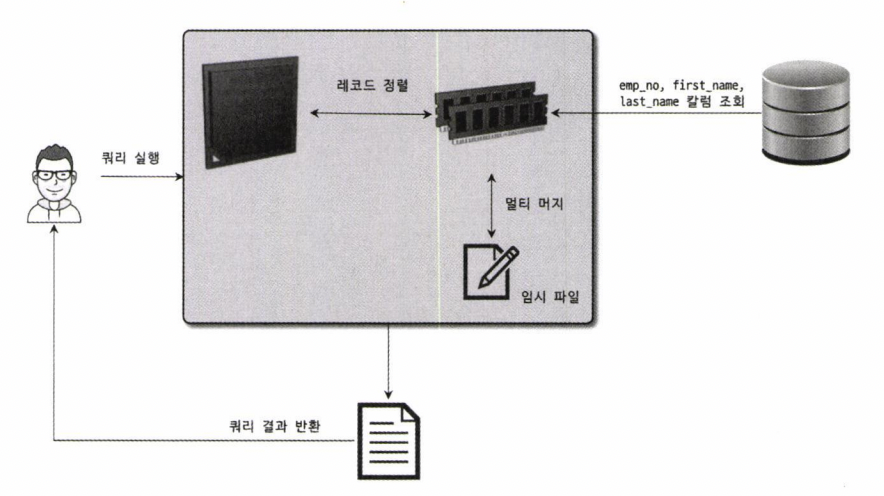
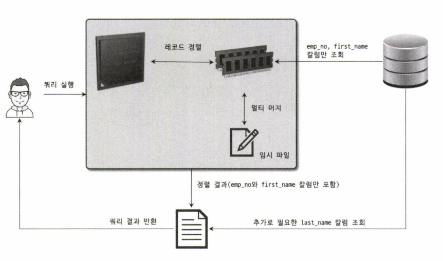
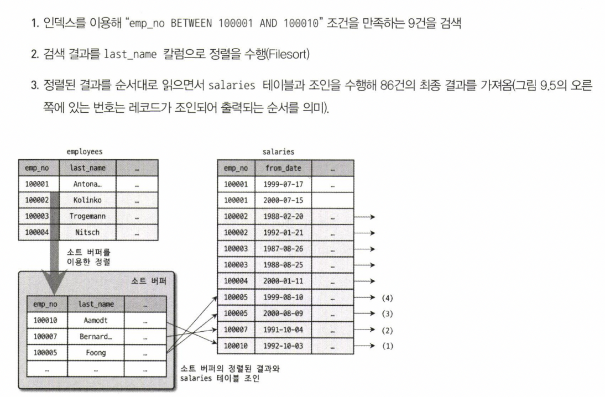
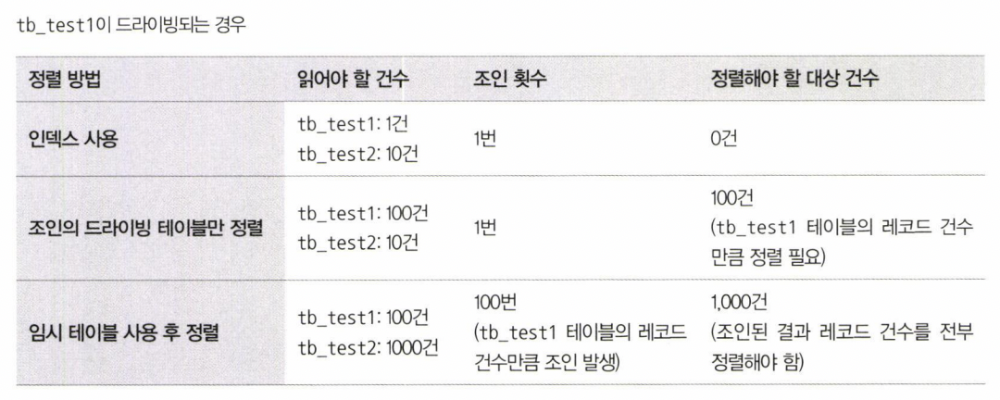
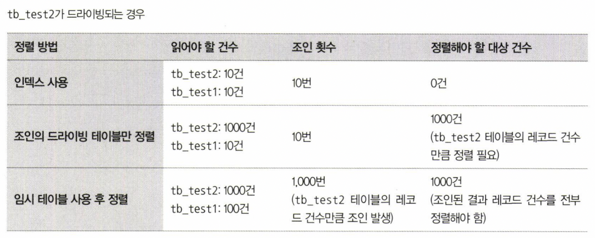

# 옵티마이저와 힌트 (1)

날짜: 2022/08/31
분류: 정리
설명: Real Mysql 11번째 스터디 수요일 리딩
페이지: 283 ~ 313

### 쿼리 실행 절차

1. SQL 파싱
   - SQL Parser라는 모듈로 SQL Parse Tree가 만들어진다
2. SQL Parse Tree를 참조하며 최적화 및 실행 계획 수립

   - 불필요한 조건 제거 및 복잡한 연산의 단순화
   - 조인이 있는 경우 어떤 순서로 테이블을 읽을지 결정
   - 인덱스 통계 정보를 이용해 사용할 인덱스를 결정
   - 가져온 레코드들을 임시 테이블에 넣고 다시 한번 가공해야 하는 지 결정

3. 수립된 실행된 계획대로 스토리지 엔진에 레코드를 읽어오도록 요청
   MySQL 엔진에서는 스토리지 엔진으로부터 받은 레코드를 조인하거나 정렬하는 작업을 수행

### 옵티마이저의 종류

1. Cost-based optimizer

   - 여러 가지 가능한 방법을 만들고 비용 산출 후 최소로 소요되는 처리 방식을 선택
   - 대부분의 RDBMS가 채택

1. Rule-based optimizer
   - 테이블의 레코드 수나 선택도 등을 고려하지 않고 옵티마이저에 내장된 우선순위에 따라 실행 계획 수립

### 기본 데이터 처리

1. 풀 테이블 스캔

   - 테이블의 레코드 건수가 너무 작아 인덱스를 통해 읽는 것보다 풀 테이블 스캔을 하는 편이 빠른 경우
     - 일반적으로 테이블이 페이지 1개로 구성된 경우
   - WHERE 절이나 ON 절에 인덱스를 이용할 수 있는 적절한 조건이 없는 경우

1. 인덱스 레인지 스캔을 사용할 수 있는 쿼리라고 하더라도 옵티마이저가 판단한 조건 일치 레코드 건수가
   너무 많은 경우

- **MySQL은 풀 테이블 스캔을 실행할 때 디스크로부터 페이지를 하나씩 읽어 오는 것일까 ?**
  MyISAM 스토리지 엔진에서는 O
  InnoDB에서는 X
  InnoDB 스토리지 엔진은 특정 테이블의 연속된 데이터 페이지가 읽히면 백그라운드 스레드에 의해 Read ahead 작업이 자동으로 시작된다
  리드 어헤드
  어떤 영역의 데이터가 앞으로 필요해지리라는 것을 예측해서 요청이 오기 전에 미리 디스크에서 읽어 InnoDB의 버퍼 풀에 가져다 두는 것
  **처음 몇 개의 데이터 페이지는 포그라운드 스레드가 페이지 읽기를 실행하지만 특정 시점부터는 읽기 작업을 백그라운드 스레드로 넘긴다**
  **포그라운드 스레드는 미리 버퍼 풀에 준비된 데이터를 가져다 사용하기만 하면 되므로 쿼리가 상당히 빨리
  처리된다**
- **SELECT COUNT(\*) FROM employees; 풀 테이블 스캔 ? 풀 인덱스 스캔 ?**
  단순히 레코드의 건수만 필요로 하는 쿼리라면 용량이 작은 인덱스를 선택하는 것이 **디스크 읽기 횟수**를 줄일 수 있다

### 소트 버프

정렬을 수행하기 위해 별도의 메모리 공간

정렬해야 할 레코드의 건수가 소트 버퍼로 할당된 공간보다 크다면 ?

→ 여러 조각으로 나눠서 처리, 임시 저장을 위해 디스크를 사용

### 싱글 패스 정렬 방식

SELECT emp_no, first_name, last_name FROM employees ORDER BY first_name;



employees 테이블을 읽을 때 정렬에 필요하지 않은 last_name 칼럼까지 전부 읽어서 소트 버퍼에 담고 정렬을 수행

### 투 패스 정렬 방식

정렬 대상 칼럼과 PK 값만 소트 버퍼에 담아서 정렬을 수행하고, 정렬된 순서대로 다시 PK로 SELECT



MySQL 서버가 싱글 패스 정렬 방식을 사용하지 못하는 경우

- 레코드의 크기가 max_length_for_sort_data 시스템 변수에 설정된 값보다 클 때
- BLOB이나 TEXT 타입의 칼럼이 SELECT 대상에 포함될 때

<aside>
💡 SELECT 시에, 모든 칼럼을 가져오도록 개발할 때가 많다
이는, 정렬 버퍼를 몇 배에서 몇십 배까지 비효율적으로 사용할 가능성이 크다

그러므로 꼭 필요한 칼럼만 조회하도록 쿼리를 작성하는 것이 좋다

</aside>

### 정렬 처리 방법

1. 인덱스를 사용한 정렬

   - ORDER BY에 명시된 칼럼이 제일 먼저 읽는 테이블에 속하고, ORDER BY의 순서대로
     생성된 인덱스가 필요
   - WHERE절에 첫 번째로 읽는 테이블의 칼럼에 대한 조건이 있다면 그 조건과 ORDER BY는 같은 인덱스를 사용할 수 있어야 한다

1. 조인의 드라이빙 테이블만 정렬

   - 조인에서 첫 번째로 읽히는 테이블의 칼럼만으로 ORDER BY 절을 작성해야 한다

   ```sql
   SELECT *
   	FROM employees e, salaries s
   	WHERE s.emp_no=e.emp_no AND e.emp_no BETWEEN 100002 AND 100003
   	ORDER BY e.last_name;

   employees 테이블이 드라이빙 테이블
   salaries 테이블이 드리븐 테이블
   ORDER BY 절의 정렬 기준 칼럼이 드라이빙 테이블에 포함된 칼럼
   ```



1. 임시 테이블을 이용한 정렬
   - 조인 결과를 임시 테이블에 저장하고, 그 결과를 다시 정렬하는 과정

```sql
SELECT *
	FROM employees e, salaries s
	WHERE s.emp_no=e.emp_no AND e.emp_no BETWEEN 100002 AND 100003
	ORDER BY e.last_name;

ORDER BY 절의 정렬 기준 칼럼이 드리븐 테이블(salaries)에 있는 칼럼
```

### 스트리밍 방식

조건에 일치하는 레코드가 검색될 때마다 바로바로 클라이언트로 전송해주는 방식

- 인덱스를 사용한 정렬 방식은 스트리밍 형태의 처리

### 버퍼링 방식

ORDER BY나 GROUP BY 같은 처리는 쿼리의 결과가 스트리밍되는 것을 불가능하게 한다

WHERE 조건에 일치하는 모든 레코드를 가져온 후, 정렬하거나 그루핑해서 차례대로 보내야하기 때문이다

### 정렬 처리 방법의 성능 비교

```sql
SELECT *
	FROM tb_test1 t1, tb_test2 t2
	WHERE t1.col = t2.col
	ORDER BY t1.col2
	LIMIT 10;

tb_test1 테이블의 레코드 100건, tb_test2 레코드 1000건,
tb_test1 레코드의 1건당 tb_test2의 레코드가 10건씩 존재한다고 가정

가능하다면 인덱스를 사용한 정렬로 유도
최소한 드라이빙 테이블만 정렬해도 되는 수준으로 유도하는 것이 좋은 튜닝 방법이다
```




